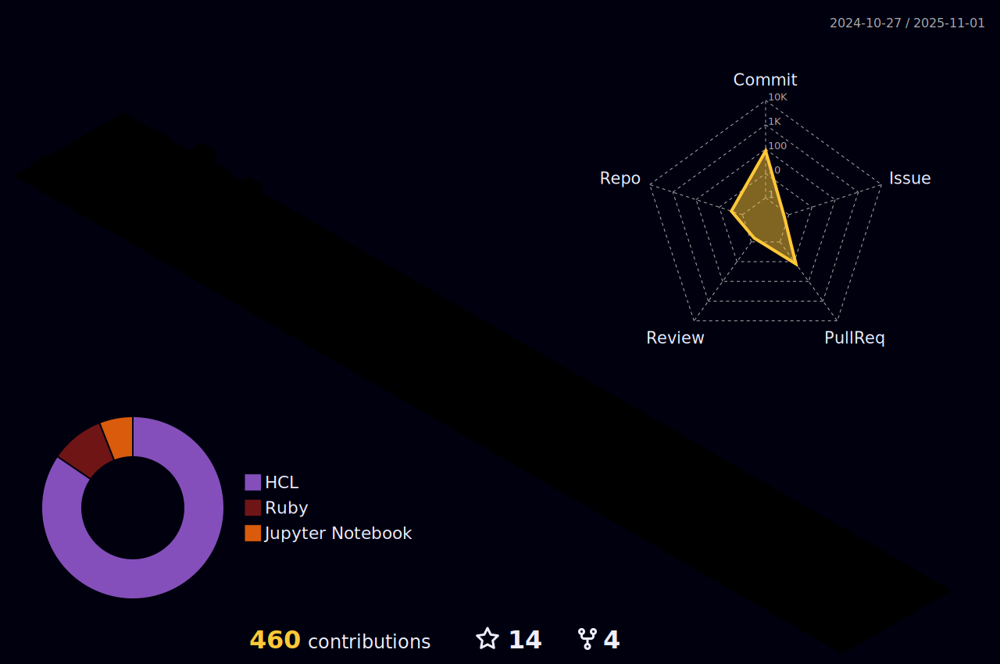

# Welcome to my profile!  

  

  

  Courage to face the unknown and the love for learning led me to development.

 My journey with development and data started with Trybe in a complete training in Web Development.

 In this training I developed a lot of knowledge that was applied in practical projects following the practices of market. We learned about agile methodologies, Scrum and Kanban, which were applied in projects undertaken in groups.

 The technologies I have experience with are Python, Node.js, JavaScript, TypeScript, Docker, NoSQL, SQL, MongoDB, MySQL, Sequelize, Jest, Mocha, Chai, Sinon, Git, GitHub, HTML, CSS, React, RTL, Redux.

 There is always more to learn, always a new world opening. All that knowledge and possibilities bring me enthusiasm since excel for me is doing better than I did before.

 The collaboration culture I have found is delighting. People working together to add to each other, to improve other people's lives.

  

 

  ## 🧰 Stacks

  |   Languages  |    Backend    |  Database   |  Versioning & Deploy  |    Business Tools    |    Tests    |    Frontend    |
  |    :---:     |     :---:     |    :---:    |       :---:           |        :---:         |    :---:    |     :---:      |
  |    |   |     |    |     |     |  |

 
  <!--  -->

## 🗃️ Projects

  

  You can find a projects list **[here](https://github.com/queite/queite.github.io/tree/main/LearningProjects).**

   

  - 📫 How to reach me:
  

    
    
  

 

---

  

<!--
**queite/queite** is a ✨ _special_ ✨ repository because its `README.md` (this file) appears on your GitHub profile.

Here are some ideas to get you started:

- 🔭 I’m currently working on ...
- 👯 I’m looking to collaborate on ...
- 🤔 I’m looking for help with ...
- 💬 Ask me about ...
- 📫 How to reach me: ...
- 😄 Pronouns: ...
- ⚡ Fun fact: ...
-->
